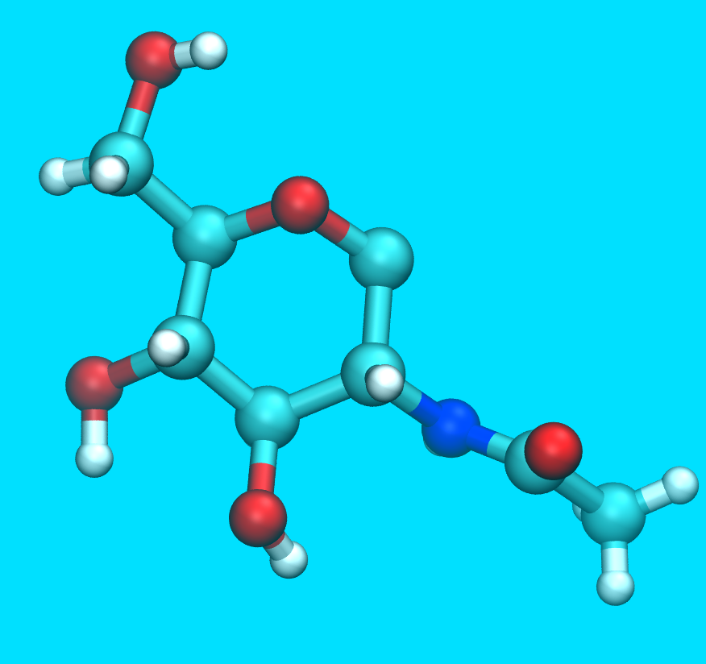

# chitin_builder
Chitin builder is a VMD plugin that generates crystal coordinates and structural/topology files of alpha or beta chitin for use in MD simulations.

*Developed by D. C. Malaspina and J. Faraudo at Institut de Ciencia de Materials de Barcelona (ICMAB-CSIC)*

[Soft Matter Theory Research Unit - ICMAB-CSIC](https://icmab.es/ts/softmattertheory)

It can be used in machines with Linux, Windows and MAC OS. Requires VMD.
For detailed documentation with the User Manual please check out the "documentation" folder.

----------------------------------------------------------------
## Citation

Please cite the following JOSS article:
[Submitted , see article folder]

----------------------------------------------------------------
## Files

* chitin-gui.tcl: main code file in tcl language.

* install.sh: bash script for installation under Linux.

* chitin_builder_release_v1.0.pdf: Documentation.

* LICENCE: licence file, please read.

* pkgIndex.tcl: subprogram in tcl for registering chitin builder into VMD menu.

* icon.png: image of a chitin monomer.

* /structures/ Folder with unit cell structures and topologies needed to generate alpha or beta chitin crystals.

* /Forcefield/ CHARMM36 carbohydrate parameters for running a MD simulation using the obtained structures.

* /documentation/ Folder containing the user Manual

* /paper/ Folder containing the paper submited to JOSS journal

* /examples/: several examples of generated structures using chitin builder. Each subfolder contains a screenshot of the input parameters and the output files.

-----------------------------------------

## Installation

Please download and unzip the code from the Download button in this repository or clone by git clone. 
To add the builder to the standard VMD extensions-modelling menu, please select the appropiate instructons depending on your OS:

-----------------------------------------
* **Ubuntu (automatic)**

Make the file install.sh executable 
From a terminal execute ./install.sh

Open VMD. Now you should have the Chitin_Builder menu installed under Extensions/Modeling/Chitin Builder/

Note: The installation script assumes that VMD is localted in the default folder /usr/local/lib. You can modify this setting by editing the install.sh file with any editor of your choice.

-------------------------------------------
* **All Linux (Manual installation)**

1) Locate the vmd folder in which the program VMD is installed. By default is /usr/local/lib/vmd  
Inside the vmd folder, locate the folder vmd/plugins/noarch/tcl/ that contains many plugins written in tcl language.
Inside this tcl folder, create a new folder with the name chitin1.0

2) Copy or move the chitin builder that you have downloaded to this new folder. You need superuser privileges.
For example, in ubuntu you can open a terminal inside the folder of the chitin buildir that you just extracted and type:

sudo cp -r * /usr/local/lib/vmd/plugins/noarch/tcl/chitin1.0/

(this example above assumes that VMD is installed in the default folder /usr/local/lib/vmd/)

3) Open VMD. Now you should have the Chitin_Builder menu installed under Extensions/Modeling/Chitin Builder/
-------------------------------------------
* **MAC (Manual installation)**

1) Locate the VMD application using Finder

A typical location is /Applications/VMD

Right click on the VMD application to open the options and click on "Show Package Contents", this will open a folder with all VMD installation.

Inside the vmd folder, locate the folder vmd/plugins/noarch/tcl/ that contains many plugins written in tcl language.
Inside this tcl folder, create a new folder with the name chitin1.0

2) Copy or move the chitin builder that you have downloaded to this new folder. 

3) Open VMD. Now you should have the Chitin_Builder menu installed under Extensions/Modeling/Chitin Builder/

** WARNING FOR MAC USERS **

Some MAC OS users experience an output writting error when the chitin builder tries to save the output data files. 
This is due to a VMD bug in MAC OS and can be solved very easily by simply opening the Tk console before using the chitin builder.
To open the Tk console, simply go to the VMD menu and select Extensions - Tk Console. 
Once the Tk console is open you can select the Chitin builder form the VMD Extensions menu (it is also OK to open first the chitin builder and then the Tk console).

-------------------------------------------
* **Windows (Manual installation)**

1) Locate the vmd folder in which the program VMD is installed. 
A typical location is C:\Program Files (x86)\University of Illinois\VMD

Inside the vmd folder, locate the folder /plugins/noarch/tcl/ that contains many plugins written in tcl language.
Inside this tcl folder, create a new folder with the name chitin1.0

2) Copy or move the chitin builder files that you have downloaded to this new folder. 

3) Open VMD. Now you should have the Chitin_Builder menu installed under Extensions/Modeling/Chitin Builder/

-------------------------------------------
## Usage

Once installed, the chitin builder can be used from the GUI available as a new VMD option or from the VMD Tk command line (see the User Manual for details). 

* **Usage from the Graphical User Interface**
  
For new users, the simplest option is using the GUI interface which can be selected from VMD menu (select: Extensions - Modelling - Chitin Builder).

The chitin builder gui allow the user to select between different options for the generation of a chitin crystal.

1) **Crystal allomorph button:** you can choose between alpha and beta chitin allomorphs.

Data of the unit cell used for the generation of the new crystal would appear under crystal allomorph button.

2) **Number of replicas input:** you can enter the number of replicas that the new crystal structure is going to contain. This number should be an integer.

3) **Periodic bonds button:** if this option is set to "yes" a bond between the first residue and the last residue in each chain will be generated. This allow to create infinitely long chains if used with periodic boundary conditions.

4) **Generate chitin structure button:** will prompt a dialog box for the destination folder and will generate a PDB + PSF file named: "crystal-alpha-psf.pdb / psf or crystal-beta-psf.pdb / psf" with the crystal structure and topology file.

The data for the new crystal cell would be print under the generate structure button and the same data will be print on the file "crystal.log".

* **Usage from the Tk Console**

Actually, it is possible to invoke the Chitin Builder functionality without using the Graphical User Interface described in the previous subsection.
Once the software is installed, from the VMD menu select the Tk Console instead of selecting the Graphical user interface.

Now, at the Tk Console the Chitin Builder can be called by typing:

package require chitin

We also need to set the working directory for chitin builder:

set chitin::fname myfolder

where "myfolder" is the desired working directory (both for temporary usage and final data storage).
This adds a new “replicate” functionality that allows the creation of chitin crystals.
The command has the following usage:

chitin::replicate n1 n2 n3 crys1 per1

The arguments n1, n2 and n3 should be integers representing the number of replicas in x, y and z respectively.
The argument crys1 should be the string “Alpha” or “Beta” depending on the chitin crystal structure to replicate.
The argument per1 should be the string “yes” or “no” depending if you want periodic bonds between the first and last residue.

The following screenshots show typical input and output examples for generating a crystal using the Tk console (see the Manual for details).

After using the Chitin Builder through the VMD command line, an error appears if afterwards you try to generate a crystal using the GUI. 
If you wish to use the GUI, restart VMD.

-------------------------------------------

